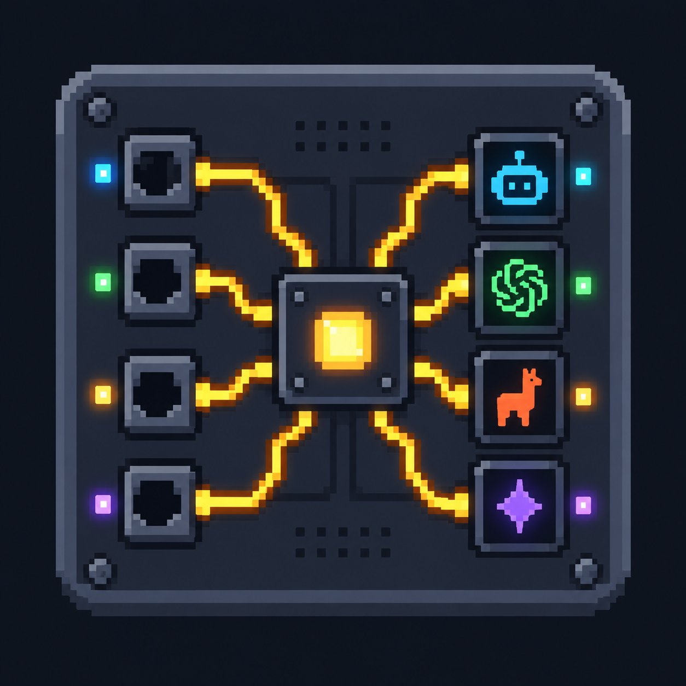
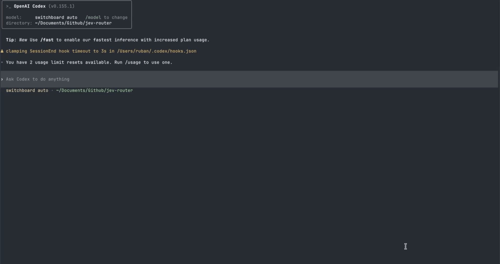
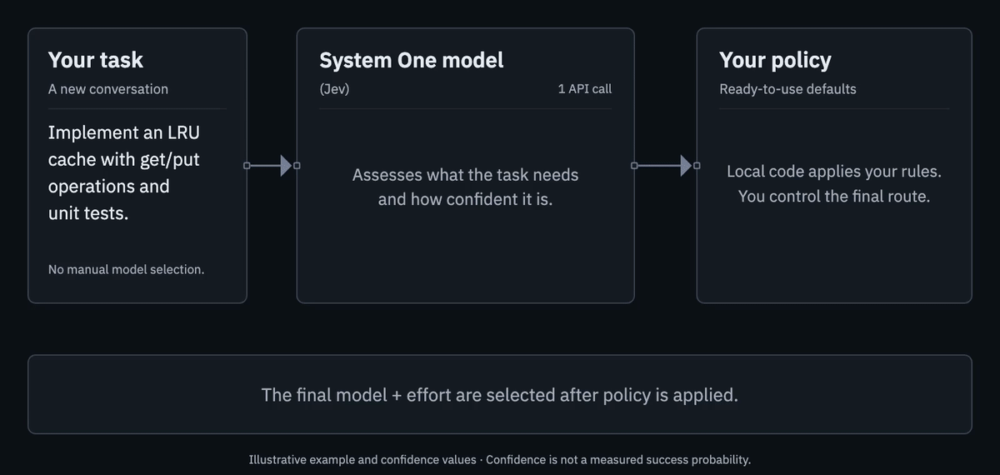

<p align="center">
  
</p>

<h1 align="center">Switchboard</h1>

<p align="center">
  <a href="https://www.npmjs.com/package/@ruban24/switchboard"></a>
  <a href="https://github.com/ruban-24/switchboard/actions/workflows/verify.yml"></a>
  <a href="LICENSE"></a>
  <a href="https://nodejs.org/en/download"></a>
</p>

<p align="center">
  <strong>Open-source model and reasoning effort routing for coding agents.</strong><br>
  Automatic model selection for Claude Code and Codex.
</p>

<p align="center">
  <a href="https://tryswitchboard.dev">Website</a> &middot;
  <a href="#get-started">Get started</a> &middot;
  <a href="#how-model-and-reasoning-effort-routing-works">How it works</a> &middot;
  <a href="docs/customization.md">Customize your policy</a> &middot;
  <a href="CONTRIBUTING.md">Contribute</a>
</p>

Switchboard automatically selects a model and reasoning effort for Claude Code
and Codex using Jev's task assessment and your routing policy. It runs inside
the coding CLI you already use, keeping the selected pair fixed through
follow-ups, tool calls, and resume.

Use it for implementation, debugging, code review, and documentation. You can
also route writing, research, and other tasks inside those CLIs; the default
routing criteria currently emphasize software engineering.

<br>



<br>

*A real Codex session: submit a task and see Switchboard's model and effort choice.*

- **Task-aware decisions.** Powered by Jev, a System One model built for fast,
  structured judgments. The routing policy is independent of the classifier;
  see [future support](#future-support) for planned additions.
- **Stable conversations.** Model and effort stay fixed through tool calls,
  follow-ups, and resume. A new conversation gets a fresh routing decision.
- **Your policy.** Use the defaults, exclude unavailable models, or customize
  model tiers, effort caps, confidence thresholds, and fallback behavior.
- **Open source and free to use.** Apache-2.0. All Switchboard routing code is
  available to inspect, change, and run yourself. No Switchboard account or
  subscription; classifier and native-provider usage are billed separately.
- **Local control.** The proxy and route history run on your machine. No
  Switchboard telemetry or hosted routing service. Hosted Jev receives task
  text through your own API key; see [privacy and data flow](docs/privacy.md).

<a name="get-started"></a>

## ⚡ Get started

You need:

- **macOS or Linux** for this first release.
- **Node.js 22.18+ and npm.** The Homebrew installation also installs Node.
- **Claude Code or Codex, installed and signed in.** Follow the
  [Claude Code quickstart](https://code.claude.com/docs/en/quickstart) or
  [Codex CLI setup](https://developers.openai.com/codex/cli) first.
- **A Jev API key** from TypeSafe, Vercel AI Gateway, or OpenRouter.

Switchboard uses your agent's existing login and does not install the agent for
you. Choose one package manager for your global installation.

**npm**

```sh
npm install -g @ruban24/switchboard
switchboard init
switchboard doctor
switchboard claude
# Or: switchboard codex
```

**Homebrew**

```sh
brew install ruban-24/tap/switchboard
switchboard init
switchboard codex
```

**npx** (no global installation)

```sh
npx --package=@ruban24/switchboard switchboard init
npx --package=@ruban24/switchboard switchboard claude
```

### What setup does

`switchboard init` walks you through three choices:

1. Detect installed coding agents and choose which to enable.
2. Select a Jev provider and enter your API key in a hidden prompt.
3. Optionally add a configuration path to your shell profile.

The key is saved in a file readable only by your user. You can launch immediately,
with no alias or shell restart. Running setup again preserves your personal policy.

Setup makes no AI calls. `doctor` checks your policy, enabled agents, and whether
a key is present; your first routed task tests the connection.

See [classifier connections](docs/classifiers.md) for endpoints,
[privacy](docs/privacy.md) for what leaves your machine, and the
[installation guide](docs/distribution.md) for shell profiles, environment
overrides, updates, and removal.

### Run from source

Clone the repository, build, and use the same setup:

```sh
git clone https://github.com/ruban-24/switchboard.git
cd switchboard
npm ci
npm run build
npm run switchboard -- init
npm run switchboard -- doctor
npm run switchboard -- claude
# Or: npm run switchboard -- codex
```

From a checkout, `npm run switchboard` also loads `.env.local` if present;
those values override saved connection settings. Installed commands do not
load project environment files.

<a name="how-reasoning-based-routing-works"></a>

## How model and reasoning effort routing works

Switchboard makes two related decisions:

- **Model:** which model has enough capability for the task?
- **Effort:** how much reasoning effort does that model need?

A stronger model at low effort and a smaller model at maximum effort are different
choices. Switchboard does not treat them as interchangeable points on one scale.



*Illustrative example: a System One model (Jev) supplies judgments and confidence; your policy makes
the final choice.* [View the static diagram](assets/routing-overview.svg).

### Assess the task

The local proxy extracts the user task and sends one request to
[Jev](https://docs.typesafe.ai/concepts/system-one). Jev returns structured answers
and probabilities; the selected model still does the work.

Jev considers how familiar the work is, what remains uncertain, which constraints
interact, and how much analysis is needed. These are criteria for its judgments,
not separate numeric scores. Prompt length alone does not determine the route.

| Judgment | What Jev returns | How Switchboard uses it |
| --- | --- | --- |
| Capability needed | Fast, balanced, strong, or highest | Maps to a model through your policy. |
| Enough context to classify? | Yes or no | Uses the configured fallback when difficulty cannot be estimated. |
| Effort for each eligible model | Low, medium, high, xhigh, or max | Reads the answer for the model policy actually selects. Haiku needs no effort answer. |
| Task type | Explain, edit, implement, debug, review, architecture, or other | Records it for diagnostics; it does not set the model tier. |

Each judgment includes a confidence value from **0 to 1**:

- Capability and selected-model effort have separate policy thresholds.
  Both default to **0.70**.
- Task-type and context confidence are recorded for diagnostics.

Confidence describes how decisive the classification is, not the probability
that the selected model will complete the task correctly.
[TypeSafe explains confidence here](https://docs.typesafe.ai/confidence).

### Apply your policy

Shipped defaults merge with your personal overrides. Policy then determines:

- **Model selection.** Map the capability tier to a model and respect your
  exclusions. Low model confidence applies a balanced minimum; a stronger
  proposed tier stays stronger.
- **Effort selection.** Read the selected model's effort answer, apply effort
  confidence rules and profile defaults, then apply your effort mappings or caps.
- **Fallback.** If Jev is unavailable or cannot classify the task, use the
  configured fallback for the new conversation.

Your policy also determines which models get effort questions in the first
place. Those conditional questions are bundled into the same Jev request;
there is no second call after model selection. The local policy makes the final
choice.

### Run and remember

The native provider executes the task. Switchboard saves the selected model and
effort locally, then:

- Reuses that pair for the conversation, including tool continuations.
- Skips classification for tool continuations.
- Can recommend a stronger route for a new conversation after a later user turn,
  without changing the active one.

Routing explanations describe the policy decision. Review the result as
you normally would; a confident classification does not guarantee a correct answer.

For implementation details, see the [architecture and routing rules](docs/routing.md),
[request/response examples](docs/classifiers.md#request-and-response-examples),
and [personal policy guide](docs/customization.md).

### Default model tiers

| Tier | Intended work | Claude Code | Codex |
| --- | --- | --- | --- |
| Fast | Mechanical edits and simple, bounded requests | Haiku | GPT-5.6 Luna |
| Balanced | Everyday implementation, familiar algorithms and scoped changes | Sonnet | GPT-5.6 Terra |
| Strong | Difficult debugging or consequential correctness decisions | Opus | GPT-5.6 Sol |
| Highest | Exceptional reasoning or extensive work beyond the strong tier | Fable | GPT-6 Astra |

For example, an LRU cache implementation ordinarily fits the balanced tier;
reviewing concurrent money transfers may need the strong tier. These describe
the policy's intent, not fixed prompt-to-model rules. Effort is assessed
separately for the selected model. Haiku gets no effort parameter; the other
configured models support mappings for `low`, `medium`, `high`, `xhigh`, and
`max`. See [routing and policy](docs/routing.md) for the exact rules.

## Keep the cache useful

Coding agents repeatedly send shared context: instructions, tool definitions,
conversation history, and code. Provider prompt caching can reuse that work.
Moving a conversation to another model can lose that reuse, so a cheaper model
midway through a task can still produce a more expensive overall run.

**Switchboard keeps both model and effort fixed for the whole conversation.**
Although some providers offer model-specific cache-preserving effort updates,
Switchboard has not yet verified and implemented them through its supported
native CLI paths.

- Follow-up prompts, tool calls, and resume keep the saved pair.
- Start a new conversation for an independent task or a stronger-model recommendation.
- An explicit native model choice still overrides automatic routing.

This avoids cache disruption caused by Switchboard changing the active model or
effort. It cannot guarantee a cache hit: provider expiration, context changes,
compaction, and native CLI behavior still matter. See the
[Anthropic](https://platform.claude.com/docs/en/build-with-claude/prompt-caching)
and [OpenAI](https://developers.openai.com/api/docs/guides/prompt-caching)
caching documentation for provider behavior.

## See what it chose

- **Claude Code:** the Switchboard status line shows the selected model and effort
  below your existing status line. The model label reads `switchboard`.
- **Codex:** a routing notice shows the selected pair in the conversation.
  The header reads `switchboard auto`.

Those labels identify automatic routing. The status line or notice shows the
model actually selected. An illustrative initial selection and follow-up look
like this:

```text
[Router] gpt-5.6-terra / medium — Jev capability and effort selection.
[Router] gpt-5.6-terra / medium — pinned for this conversation.
```

For either CLI, inspect a saved conversation with:

```sh
switchboard explain claude CONVERSATION_ID
switchboard explain codex CONVERSATION_ID
```

Use the native session UUID as `CONVERSATION_ID`. The
[session guide](docs/native-cli.md#find-a-conversation-and-resume-it) shows how to
find it and resume through Switchboard. From a source checkout, use
`npm run switchboard -- explain` in place of `switchboard explain`.

`explain` shows the active model and effort, the policy reason, confidence
adjustments, and any recommendation for a new conversation.
[Native CLI details](docs/native-cli.md) explain this behavior.

Route metadata is stored locally without raw prompts by default. You can inspect
the decision without enabling task-text logging.

<a name="set-your-limits"></a>

## ⚙️ Set your limits

Personal settings live at `~/.config/switchboard/policy.json` by default.
Run `doctor` to find the actual path. You can change:

- **Model choices:** exclude unavailable models or change which model each tier uses.
- **Reasoning effort:** remap effort levels or cap the effort a model can use.
- **Decision rules:** adjust confidence thresholds and fallback models.

For example, exclude models your plan cannot use or tiers you prefer not to spend on:

```json
{
  "excludedModels": {
    "claude": ["claude-fable-5-1"],
    "codex": ["gpt-6-astra"]
  }
}
```

To apply a personal override:

1. Edit your personal `policy.json`. Only include settings you want to change;
   objects merge with the defaults, while arrays replace them.
2. Run `switchboard config check` to validate it and `switchboard config show`
   to inspect the merged policy.
3. Relaunch Switchboard and start a new conversation. Existing conversations
   retain their saved pair.

Keep overrides in your personal file so package updates preserve them.
The [customization guide](docs/customization.md) explains each option and its effect.

For setup errors or a route that keeps falling back, see
[troubleshooting](docs/native-cli.md#troubleshooting). The
[installation guide](docs/distribution.md#upgrade-or-uninstall) covers updates,
uninstallation, and saved settings.

The [policy reference](docs/routing.md) also covers profiles, timeouts, and
local history settings.

<a name="privacy-and-supported-use"></a>

## 🔒 Privacy and supported use

Switchboard is fully open-source software, with no Switchboard backend receiving
your prompts. You control the code, keys, policy, and local route history.

- **Classification:** the hosted classifier receives extracted task text,
  including any code or secrets you put in that prompt.
- **Native inference:** requests go to your native provider.
- **Local logging:** raw-prompt logging is off by default. Native transcripts
  and provider retention are separate.

Read [the data flow](docs/privacy.md) before using it with sensitive work.

<a name="supported-today"></a>

### Supported coding agents and platforms

- **Agents:** Claude Code and Codex in local interactive CLI sessions.
- **Platforms:** macOS and Linux. Both adapters have passed interactive validation
  on macOS and a Debian Linux VM with native sandboxing.
- **Classifier:** Jev through TypeSafe, Vercel AI Gateway, or OpenRouter.

Native Windows, desktop-app routing, remote/background sessions, and custom
model gateways are outside v0. See [native CLI compatibility](docs/native-cli.md)
for tested versions and limitations.

## Future support

<a name="coding-agents"></a>
<a name="agent-integrations"></a>

### Planned agent integrations

- Pi (coming soon)
- OpenCode (coming soon)

### System One models

- Laya (coming soon)
- Kev (coming soon)
- Cua-S1 (coming soon)

Each classifier needs an adapter for its judgments and confidence format.
A new endpoint alone does not make a different model compatible.

## Contribute and support

- **Contribute code or report a routing problem:** start with
  [CONTRIBUTING.md](CONTRIBUTING.md) for setup, checks, and native adapter guidance.
  Run `npm test` and `npm run test:package` before submitting a code change.
- **Report a vulnerability:** follow [SECURITY.md](SECURITY.md).
- **Read release notes:** see [CHANGELOG.md](CHANGELOG.md).

If you would like to support development, you can sponsor me or buy me a coffee.

<p>
  <a href="https://github.com/sponsors/ruban-24"></a>
  <a href="https://buymeacoffee.com/rubanbhatia"></a>
</p>

## License

[Apache-2.0](LICENSE). Copyright 2026 Ruban. See [NOTICE](NOTICE) and
[third-party licenses](THIRD_PARTY_NOTICES.md).

---

<p align="center">
  If Switchboard helped you, please <a href="https://github.com/ruban-24/switchboard">give it a star ⭐</a>.
</p>
